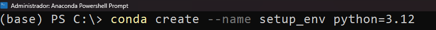
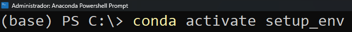
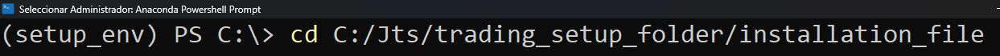
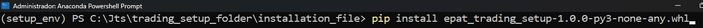
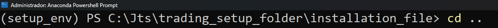
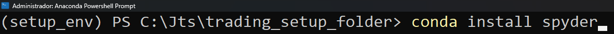
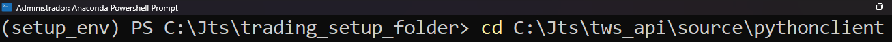
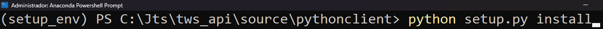
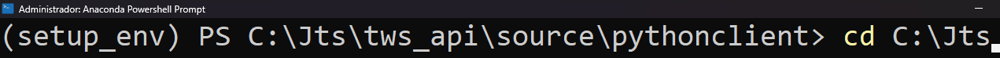
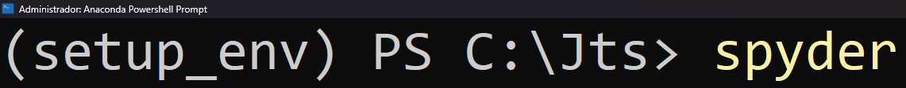

# An end-to-end setup to trade forex algorithmically

#### This is your “Start here” document to set up your system for trading forex algorithmically.
###### QuantInsti Webpage: https://www.quantinsti.com/

# DISCLAIMER

#### This file is documentation only and should not be used for live trading without appropriate backtesting and tweaking of the strategy parameters.

## Licensed under the Apache License, Version 2.0 (the "License"). 
- Copyright 2024 QuantInsti Quantitative Learnings Pvt Ltd. 
- You may not use this file except in compliance with the License. 
- You may obtain a copy of the License at http://www.apache.org/licenses/LICENSE-2.0 
- Unless required by applicable law or agreed to in writing, software distributed under the License is distributed on an "AS IS" BASIS, WITHOUT WARRANTIES OR CONDITIONS OF ANY KIND, either express or implied.

## Table of contents
1. [Introduction](#introduction)
2. [Crucial attributes](#crucial_attributes)
3. [Setup Notes](#setup_notes)
4. [Interactive Brokers setup requirements](#ib_requirements)
5. [Setup of variables](#variables_setup)
6. [Quick start](#quick_start)

## Introduction 
We are happy to introduce a working version of our Python-based setup to trade forex algorithmically. It is meant for forex trading with the Interactive Brokers API. This script allows you to execute transactions in the forex market using a customizable strategy, and swap out forex assets as needed. 

The script-based application aims to teach you how to use a ready-made IB-API-based trading app and how it works during each trading period. We refer to our labor of love as a Python-based setup, trading app, or similar such names. We hope it’s self-evident that they all refer to the same thing!

## Crucial attributes:
- Forex trading: Our script functions and is optimized for this asset class in a streamlined manner because we created it with Forex trading in mind. You can execute trades confidently because we’ve created it considering the nuances of the Forex markets. 
- Strategy customization: Our script empowers you to modify trading strategies according to your preferences and market conditions. You can control your trading approach by adjusting risk parameters or refining entry and exit criteria.
- Flexible asset selection: You can modify your trading strategies to profit from any Forex pair by having the flexibility to switch up your Forex assets. You can use this trading application on as many Forex pairs as IB allows.
- Integration with Interactive Brokers API: Our script utilizes the Interactive Brokers API to allow you to execute trades quickly and connect you to real-time Forex market data. This integration ensures reliable access to market data and execution capabilities.
- Effective operation: Devoid of graphical user interfaces, we use only scripts if you want to quickly learn the intricacies of the trading app code. You can make trades quickly and concentrate on the main file variables of the trading app.

## Setup notes
1. If you want to use the same strategy to check how the setup works, you should only need to modify the “main.py” file. In case you want to modify the strategy at your convenience, please also modify the “strategy_file.py” file. Only Forex contracts should be traded with this trading app.
2. If you run the trading setup for the first time, you'll see that you'll be downloading historical minute data. It will take like 3 to 5 days to complete the downloading (it will download from 2005 to 2024). This only happens at the very first time. Once you have the historical minute data up to date, you'll have the trading setup running.
3. The Forex market closes from 5 pm to 6 pm Eastern time and the stop-loss and take-profit targets get discarded at 5 pm. Each day the setup will close all the existing positions half an hour before 5 pm. We decided this arbitrarily and it can be modified. 
4. The setup will not leave any open positions on weekends. 
5. The strategy is based on bagging with a random forest algorithm. It creates long and short signals. To learn more about it, refer to the MLT-04 lecture.
6. The trading setup is designed to retrieve historical data from up to 10 previous days. If your historical data has missing data for more than 10 days, you’ll need to run the setup to download historical data and update the dataframe.
7. In case you want to get the live equity curve of the strategy, once you start trading, please go to the “epat_trading_app_database.xlsx” Excel file, sheet “cash_balance”, column “value”. Plot that column to see the equity curve graphically.
8. In case you want to make more changes to the setup so it can be better customized per your needs, please modify all the other relevant files as needed.

## Interactive Brokers setup requirements

1. Installation of the **offline stable** version of the TWS. Save the TWS file in “path_to/Jts/tws_platform
2. Installation of the **stable** version of the IB API. Save the IB API files in path_to/Jts/TWS_API
3. Save all the above inside the Jts folder
4. Log in with your account credentials in the IB web platform and then go to Settings. Next, in the “Account Configuration” section, click on “Paper Trading Account”. Finally, click on the “Yes” button against the question “Share real-time market data subscriptions with paper trading account?” and click on “Save”. Wait at least 2 hours to let IB make the paper account have market data subscriptions.
5. In the TWS or IB Gateway platform, do the following: Go to File, Global configuration, API, and in Settings:
    1. Check “ActiveX and Socket Clients”
    2. Uncheck the “Read-Only API”
    3. In the “send instrument-specific attributes for dual-mode API client in” box, select “operator timezone”.
    4. Click on the “Reset API order ID sequence” whenever you need to restart paper or live trading.
6. In the TWS or IB Gateway platform, do the following: Go to File, Global configuration, Configuration and in “Lock and Exit”:
    - In the “Set Auto Logoff Timer” section, choose your local time to auto-log off or auto-restart the platform. Due to the IB platform specifications, in case you select auto-restart, it must restart at the specific hour you select. Be careful with this. When selecting auto restart, sometimes it doesn’t work properly, so you might need to log in to the platform again manually. 
7. In Configuration, Export trade Reports, check the “Export trade reports periodically”.
8. In the same section from above, in the “Export filename”, type: “\path_to\Jts\trading_setup_folder\trade_reports”. This file will give you a trade report of all the trading positions you took while trading.
9. In the same section from above, in the “Export directory”, type: “\path_to\Jts\trading_setup_folder\trade_reports”. This folder will be used to save the trade report from above.
10. In the same section above, specify the interval at which you would like the reports to be generated.
11. Depending on your initial equity and trading frequency, you will have different equity curves throughout time. If you first want to try paper trading, you should set the initial equity value. To do this, please go to https://www.interactivebrokers.co.uk/sso/Login and do the following:
    1. Select “Paper”, instead of “Live”
    2. Login with your username and password
    3. Go to “Settings”
    4. Go to “Account Settings”
    5. In “Configuration”, click on the nut button of the “Paper Trading Account Reset”
    6. In the “Select Reset Amount” box, click on “Other Amount”. In the “Amount” box, write a specific amount you want to use as an initial equity value. Read the below instructions and click on Continue.
12. In case you want to reset the paper trading account to default settings, do the following:
    1. Drop all the created files while trading except those files contained in the zip folder named “trading_app_folder”.
    2. Go to the TWS platform, go to the “File” tab, click on “Global Configuration”, click on “API settings”, and click on the “Reset API order ID sequence” button. Finally, click on “Apply” and “Ok”. Then you can paper trade once again from the start. In case you have live traded, please close any existing position on any asset before you restart live trading with the app.
13. To profit from forex leverage, you need to **ask IB to have a margin account for forex**. If you don’t do it, you will not be able to trade at all your capacity.

## Setup of variables
Inside the “epat_trading_app_main_file” file, you can change the following variables per your trading requirements. Each variable is explained and some extra information is added.

- **account**: The account name of your IB account. This account name starts with U followed by a number for a live trading account and starts with DU followed by a number for a paper trading account. Learn more in the TBP-01 lecture.
- **timezone**: Set the timezone of your country of residence. Please select the appropriate timezone as per the available Python time zones.
- **port**: The port number as per the live or paper trading account. Learn more in the TBP-01 lecture.
- **account_currency**: The base currency that your IB account has. You set the base currency while creating your IB account. It can be USD, EUR, INR, etc.
- **symbol**: The Forex symbol to be traded. Choose as per the IB available forex assets to be traded. 
- **data_frequency**: The frequency used for trading. Please set this variable to ‘24h’ if you want to trade daily. The app is not designed to trade with a frequency lower than daily (2-day, 3-day, etc.). Be careful while deciding the data_frequency because the signal creation might take longer than your chosen trading frequency. To check how much time it takes to run the strategy, you should check for each period the “epat_trading_app_database” file, sheet “app_time_spent”, column name “seconds”, and the unique value. 
- **local_restart_hour**: The local timezone hour you previously selected to log off or auto-restart your IB TWS. If you log off or auto-restart at 11 pm in the TWS platform, please set this variable to 23, and so on.
- **historical_data_address**: The string of the historical data file name and address. The data file is the resampled data per the frequency you set above.
- **base_df_address**: The string of the dataframe used to fit the machine learning model. Set the file name and address at your convenience.
- **train_span**: Set the train data number of observations to be used to fit the machine learning model. Please check the historical_data_address file to specify a number equal to or lower than the maximum data observations available in the historical dataframe file.
- **test_span_days**: To optimize the strategy, specify how many days you want to use as a validation dataset. The higher the trading frequency, the higher this number should be. For a daily frequency, set 22 days as a monthly validation dataset.
- **max_window**: The machine learning model uses technical indicators as input features. Some of these technical indicators use rolling windows to compute them. Set this variable as the maximum window to calculate the technical indicators.
- **host**: Set the host for the trading app. Learn more in the TBP-01 lecture.
- **client_id**: Set the client ID for the trading app. Learn more in the TBP-01 lecture.
- **seed**: Set the seed to create a list of random seeds for the machine learning strategy. Each seed provides a unique machine-learning model to be used for backtesting it. The best model is chosen based on the machine learning model that gives the best Sharpe ratio of its strategy returns.
- **random_seeds**: Set the random seeds to be used as a list of model seed parameters. If you want to vary the machine-learning model per other parameters, modify the strategy_file file. In the main file, the default is 5 seeds to be used. If you want to add more, please change that number. Be careful about how much time the backtesting lasts. The backtesting is done so that it only optimizes on the weekend.
- **purged_window_size**: You can set the purge window size at your convenience. For more information, please refer to the MLT-04 lecture.
- **embargo_period**: Set the purge embargo period at your convenience. Please refer to the MLT-04 lecture to learn more.
- **leverage**: Set the leverage you will use at your trading convenience. If you want to create a dynamic leverage position, please change the strategy_file file.
- **risk_management_target**: Set the risk management target. This should be an absolute price return target. If you want to create a dynamic target position, please change the strategy_file file.
- **stop_loss_multiplier**: This should be an integer or float target that will multiply the risk_management target for the stop-loss orders at your convenience. If you want to create a dynamic multiplier target, please change the strategy_file file.
- **take_profit_multiplier**: This should be an integer or float target that multiplies the risk_management target for the take-profit orders at your convenience. If you want to create a dynamic multiplier target, please change the strategy_file file.
- **smtp_username**: Your Gmail to be used from which you’ll send the trading information per the above trading data frequency.
- **to_email**: The email (it can be any email service: Gmail, Outlook, etc.) to send the trading information per the above trading data frequency.
- **password**: The app password that was obtained from Google Gmail. You need to allow the app password in Google: https://support.google.com/mail/answer/185833?hl=en. Once you access the link, click on the link “Create and manage your app passwords”. Then, type your email and password and you’ll be directed to the “App passwords” webpage. There, you type an app name, it can be any name, and then you’ll be given a 12-letter-long password. Copy that password and paste it into this variable.
Quick start

## Quick start
1. Download the "trading_setup_folder" zip file, unzip it, and move the unzipped folder into the “..path_to/Jts" folder.
2. Open an Anaconda terminal (or a terminal in Linux or Mac), then type (wait until each command is completely run):

    - conda create --name setup_env python=3.12
   
      
      
    - conda activate setup_env
      
      
      
    - cd 'path_to/Jts/trading_setup_folder/installation_file'
      
    - pip install epat_trading_setup-1.0.0-py3-none-any.whl
      
    - cd ..
      
    - conda install spyder
      

3. Since you have already installed the IB API in 'path_to/Jts/tws_api'. Let's install it in our 'setup_env" environment. Type:
    - cd 'path_to/Jts/tws_api/source/pythonclient'
      
    - python setup.py install
      
    - cd C:\Jts
      
    - spyder
      
4. Once Spyder is opened, select as main folder the "trading_setup_folder" folder and open the "main.py" 
5. Modify the inputs as per your trading requirements.
6. Run the file, and
  
# Go live algo trading!
