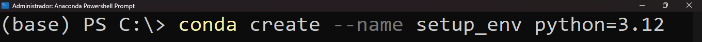
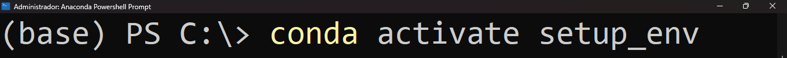
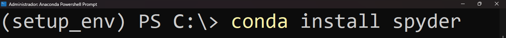
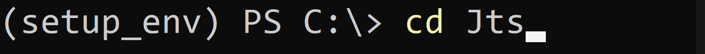
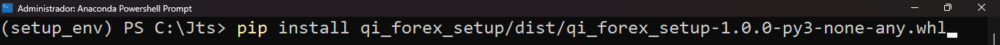
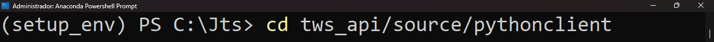
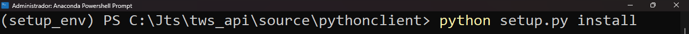
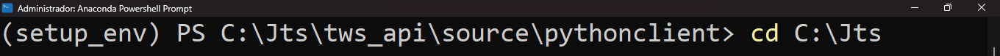
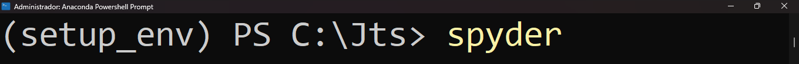

## Introduction

This folder contains a working trading setup you can use to learn how to trade in the financial markets algorithmically. The setup can be used to trade any forex asset using the Interactive Brokers API. 

_@JCT, please make changes to the below part similar to what I've done in the other readme.md file_

## Disclaimer
**This trading setup and its strategy are just a template and should not be used for live trading without appropriate backtesting and tweaking of the strategy parameters.**

1. Cautionary Note
    - Trading is not appropriate for all investors and carries a significant risk.
    - Markets are very unpredictable and unstable, and past performance does not guarantee future outcomes.
    - The trading setup and the strategy that are provided here are merely meant to be educational; they are not meant to be regarded as specific investing advice.
2. Limitations and Assumptions
    - Trading Experience: The trading setup and the strategy provided here are predicated on the supposition that traders possess the necessary expertise to comprehend the risks involved and modify both according to their unique risk tolerance and preferences.
    - Risk Capital: Trading should only be done with risk capital, and only people who have enough of it should think about trading. It is not advisable to trade with capital that can affect your way of life or your financial commitments.
    - Market Volatility: The trading setup and the strategy provided here are contingent upon the state of the market and may not yield anticipated results during periods of high market volatility or atypical occurrences.
    - No Promises: Trading losses are a possibility, and neither success nor profit are certain.
3. Accountability: By utilizing this trading setup and the strategy detailed in this repository, you agree that:
    - You have read and understood the disclaimer and risk warning.
    - You assume full accountability for the decisions you make about trading and investing.
    - You alone will bear responsibility for any losses you incur if you employ this trading setup and approach.
4. Additional Notes
    - Before putting any trading technique into practice, you must perform your own independent research and due diligence.
    - Trading involves emotions, and it is crucial to manage your emotions and risk tolerance effectively.
5. By continuing to use this trading setup and/or the strategy
    - You attest that you have read, comprehended, and accepted the risk warning and disclaimer.
    - You understand that trading carries a significant risk and that your trading and investment decisions are entirely your responsibility.

## Table of contents
1. [Author](#author)
2. [Setup properties](#properties)
3. [Read the documentation](#documentation)
4. [Ask for help](#help)
5. [Quick start](#start)

## Author
- [José Carlos Gonzáles Tanaka](https://www.linkedin.com/in/jose-carlos-gonzales-tanaka/)
- QuantInsti's EPAT content team is responsible for maintaining and contributing to this project.

## Setup details
- The trading setup allows you to trade any forex asset available in Interactive Brokers.
- You can only trade forex assets with this trading setup.
- It uses the stable version of the Interactive Brokers API (IB API).
- It can be used with the TWS platform or the IB Gateway as long as the trader installs the stable versions of each.
- The setup is packaged as a Python library and is installable with one single code line.
- You can use the trading setup package with any operating system, and from any country or timezone.
- There are two files apart from the trading setup package: The 'main' file and the 'strategy_file' file. You can use the former to run the whole trading setup. You can change the latter at your discretion. It contains all the relevant functions you can tweak to use your strategy. _@JCT, please name the files and enclose their names in quotes or in a distinctive way._
- The trading setup configuration consists only of the 'main' and the 'strategy' file. If you want to test the setup only, you can modify the main file and then run it. If you want to incorporate your strategy, modify both files and run the main file. _@JCT, please name the files and enclose their names in quotes or in a distinctive way._
- The setup is ready to be tested or modified to meet your needs.

## Read the documentation
You can use this setup only for forex assets with an Interactive Brokers API. 
- To test the trading setup quickly, please read: “Start_here_documentation”.
- To use a customized strategy, please read: “Strategy_documentation”.
- To learn more about the trading setup, please read: “The_trading_setup_references”.

## Ask for help
In case of questions, please write to:
- Your support manager (if you’re a present EPAT student)
- The alumni team (if you’re a past EPAT student and an alumnus)
- QuantInsti coordinates you, see on our “Contact Us” page: [https://www.quantinsti.com/contact-us](https://www.quantinsti.com/contact-us)

## Quick start
1. Download the "dist" and the "samples" folders, and save them in the “..path_to/Jts/setup" folder.
2. Open an Anaconda terminal (or a terminal in Linux or Mac), then type (wait until each command is completely run):

    - conda create --name setup_env python=3.12
   
      
      
    - conda activate setup_env
      
      
      
    - conda install spyder
      
      
    - cd 'path_to/Jts'
      
    - pip install qi_forex_setup/dist/qi_forex_setup-1.0.0-py3-none-any.whl
      

4. Since you have already installed the IB API in 'path_to/Jts/tws_api'. Let's install it in our 'setup_env" environment. Type:
    - cd 'path_to/Jts/tws_api/source/pythonclient'
      
    - python setup.py install
      
    - cd C:\Jts
      
    - spyder
      
5. Once Spyder is opened, select as main folder the "setup" folder and open the "main.py" 
6. Modify the inputs as per your trading requirements.
7. Run the file, and

# Go live algo trading!
